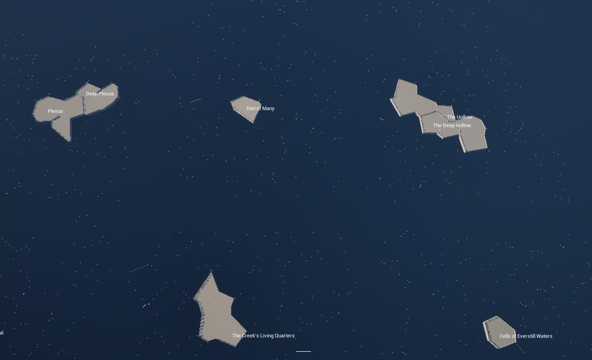
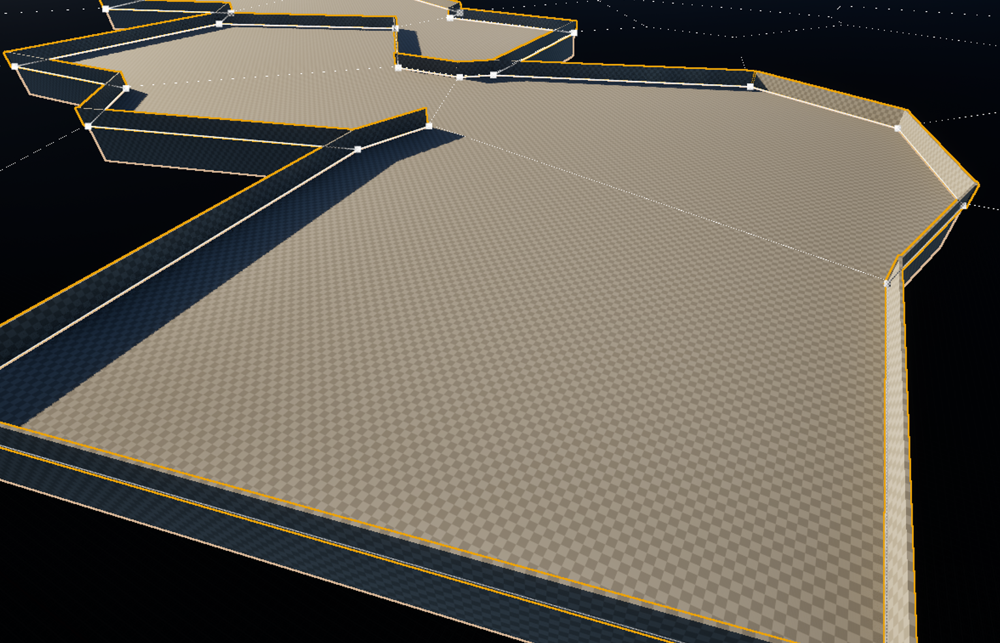
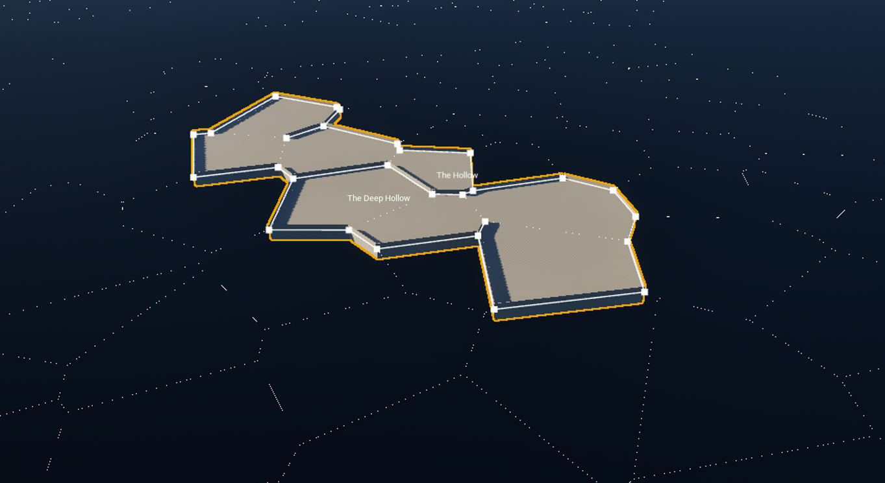

# ProceduralGeometry

`ProceduralGeometry` is a runtime Unreal Engine module of 2D layout and mesh-generation utilities. It provides grid-based Voronoi diagrams, raster layout generators (Drunkard's Walk and Cellular Automata), polygon helpers, and a prism mesh factory. This project's vendored version links `Core`, `CoreUObject`, `Engine`, `ProceduralMeshComponent`, and the Core-only `VariatCore` module for common probability and count-allocation rules. It has no dependency on gameplay or editor modules.

The ADRoguelike repository tracks these source files directly; it is not a Git submodule. A local nested `.git` checkout is not the source of truth for this project's build. Copy `Source/VariatCore` as well when reusing this version in another project, register both runtime modules, and keep their shared selection contract together. Upstreaming to a separate geometry repository is a separate operation.

## Add the module to a project

Add `ProceduralGeometry` as a runtime module in the project's `.uproject`, then add it to the consuming module's `PublicDependencyModuleNames` (or `PrivateDependencyModuleNames` when no public header exposes it):

```csharp
PublicDependencyModuleNames.AddRange(new string[]
{
    "Core",
    "CoreUObject",
    "Engine",
    "ProceduralMeshComponent",
    "ProceduralGeometry"
});
```

Include the public headers by their module-relative paths. The generator classes are `UObject`s. For a generator used beyond one synchronous call, retain it as a reflected `TObjectPtr<UVoronoiGenerator2D>` member (for example, `UPROPERTY() TObjectPtr<UVoronoiGenerator2D> Generator;`) on a live UObject, or with a `TStrongObjectPtr` in non-UObject code; an `Outer` passed to `NewObject` alone does not keep the generator alive across garbage collection. The example below uses the transient package and consumes the generator immediately, so it does not retain it.

## Minimal generator and mesh example

The following example uses a real public entry point from each side of the module. A generated Voronoi cell is convex and counter-clockwise, which makes it valid input for `CreatePrismMesh`:

```cpp
#include "Factories/ProceduralMeshFactory.h"
#include "Generators/Voronoi2D/VoronoiGenerator2D.h"
#include "ProceduralMeshComponent.h"

void BuildDemoSection(UProceduralMeshComponent* ProceduralMeshComponent)
{
    if (!ProceduralMeshComponent)
    {
        return;
    }

    UVoronoiGenerator2D* Generator = NewObject<UVoronoiGenerator2D>(GetTransientPackage());
    Generator->SetBounds(FBox2D(FVector2D(-5000.0, -5000.0), FVector2D(5000.0, 5000.0)))
        ->SetSeed(TEXT("demo-seed"))
        ->SetRelaxationIterations(2);

    const FVoronoiDiagram2D Diagram = Generator->GenerateRelaxed(24);
    if (Diagram.Cells.Num() > 0 && Diagram.Cells[0].bIsValid && Diagram.Cells[0].Vertices.Num() >= 3)
    {
        // Diagram owns the vertex array; it remains alive and unmodified through this call.
        FMeshGenerationParams Params;
        Params.FoundationVertices = MakeArrayView(Diagram.Cells[0].Vertices);
        Params.BaseZ = 0.0;
        Params.Height = 100.0f;
        Params.UVScale = 0.01f;

        FMeshData Mesh;
        if (UProceduralMeshFactory::CreatePrismMesh(Params, Mesh))
        {
            ProceduralMeshComponent->CreateMeshSection_LinearColor(
                0, Mesh.Vertices, Mesh.Triangles, Mesh.Normals, Mesh.UVs,
                Mesh.VertexColors, Mesh.Tangents, Params.bGenerateCollision);
        }
    }
}
```

For raster layouts, use the same UObject pattern with `UDrunkardWalkGenerator2D` or `UCellularAutomataGenerator2D`, configure them with their `Set...` methods, then call `Generate()` for the stable `FLayoutDiagram2D` result. `GenerateWithGridData()` returns intermediate state intended for visualization and tests; its layout fields do not carry the production compatibility contract.

## Public API and input contracts

- `UVoronoiGenerator2D::GenerateRelaxed`, `GenerateRandomSites`, and `GenerateFromSites` return `FVoronoiDiagram2D` by value. Cells expose convex, counter-clockwise `Vertices`; `FVoronoiDiagram2D` owns its arrays and is safe to retain as a value.
- `UDrunkardWalkGenerator2D::Generate()` and `UCellularAutomataGenerator2D::Generate()` return `FLayoutDiagram2D` by value. The diagrams own their cell arrays. The `...WithGridData()` methods expose intermediate state for diagnostics and tests.
- `UProceduralMeshFactory::CreatePrismMesh` expects at least three points in a convex, counter-clockwise footprint. Do not pass a concave polygon: the cap uses a fan triangulation and will be incorrect. `Height` must be positive. On success the factory resets and fills `OutMeshData`; when input is rejected it leaves the output untouched.
- `FMeshGenerationParams::FoundationVertices` and `EmitSkirtPerEdge` are `TArrayView`s. They borrow caller-owned arrays and those arrays must remain alive and unmodified until `CreatePrismMesh` returns. The returned `FMeshData` owns its generated vertex/index/normal/UV/color/tangent arrays and can be passed to `UProceduralMeshComponent` afterwards.
- If `EmitSkirtPerEdge` is empty, every footprint edge gets a side skirt. If it has exactly one bool per footprint vertex, `false` suppresses that edge's skirt. `BuildSlabSkirtMasks` produces this form for a set of Voronoi cells; the referenced cell objects must remain valid for the call.

The module's polygon helpers in `GeometryFunctionLibrary.h` are stateless functions over caller-owned arrays. Reuse the overload of `ClipPolygonByHalfPlane` that accepts a scratch array when clipping repeatedly to avoid per-call allocations.

## Tests

The existing Automation Tests are registered under the `ProceduralGeometry` category, including geometry utilities, Voronoi, Drunkard's Walk, Cellular Automata, and mesh-factory coverage. With the project/editor closed, run the category from the project root:

```powershell
& "D:\UnrealEngine\UE_5.8\Engine\Binaries\Win64\UnrealEditor-Cmd.exe" `
    "ADRoguelike.uproject" `
    -ExecCmds="Automation RunTests ProceduralGeometry; Quit" `
    -unattended -nullrhi -nosplash -nopause -NoLiveCoding
```

Test names and shared flags live under `Source/ProceduralGeometry/Private/Tests`; the category prefix also includes its subcategories.

## Simple showcase of module capabilities

Here's a small example of what this module can produce.

Overall generation layout (multiple Voronoi diagrams)


Procedural meshes (walls are spawned via PCGGraph though). UVs are fully customizable, foundations are `UProceduralMeshComponent` sections.


> These screenshots were made using additional project code not presented in this module.
