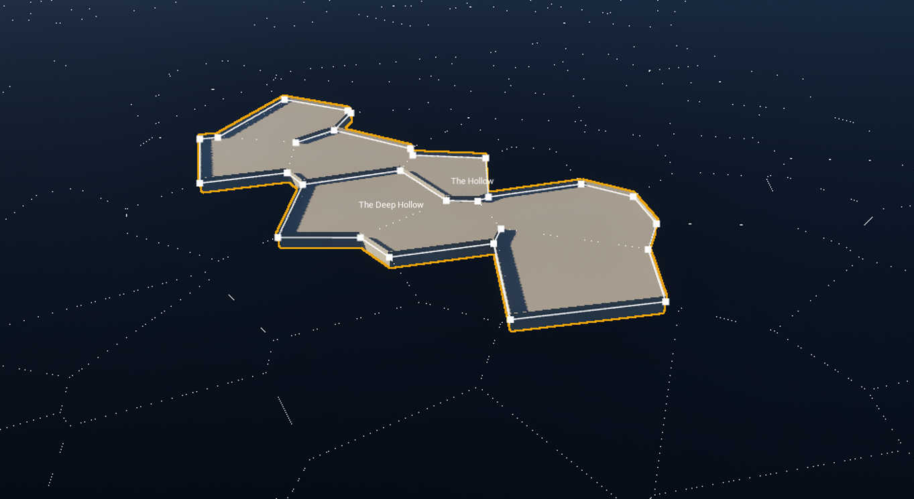

# What is this repo:

- Various utilities for procedural geometry workflows in UE (presumably 5+).
- 2D Voronoi tesselation (sadly, I couldn't find a way to use original Voro++, except converting the whole diagram to the 2D space which was a bit expensive)
- 2D points grid scattering
- Drunkard's walk 2D Graph gen (configurable)
- Cellular automata (configurable)

# How can I use it:
- However you want, I've spent multiple months learning these things, hope this code can save some time for you!
- I would be thrilled to see someone contributing here for sure

# Simple showcase of module capabilities:
Here's small example of what I've been doing and the reason I've created this repo.

Overall generation layout (multiple Voronoi diagrams)

Procedural meshes (walls are spawned via PCGGraph though). UVs are fully customizable, foundations are UProceduralMeshComponent sections

> These screenshots are made using some additional code, not presented in this repo. Feel free to ask questions about implementation details if you want :)